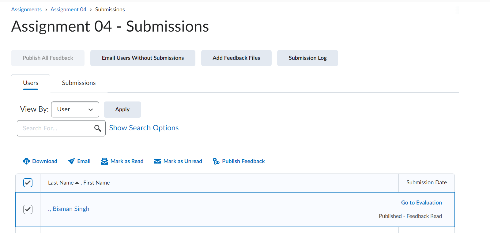
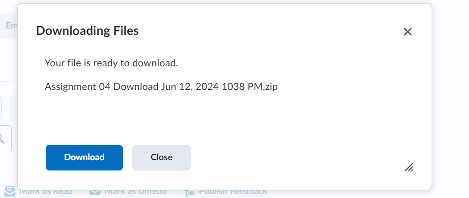
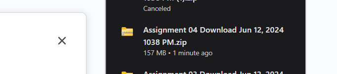

# Brightspace Submission Fetcher

This Python script automates the process of downloading, unzipping, and organizing student submissions for marking based on your student allocation.

_____

## Prerequisites

- Python 3.x
- Required Python packages: `os`, `shutil`, `csv`, `zipfile`

_____

## Setup

1. Ensure Python 3.x is installed on your system.
2. Download the script to your local machine.
3. Modify the script constants to match your environment:
   - `STUDENT_ALLOCATION_START`: Starting row index for student allocation in the CSV.
   - `STUDENT_ALLOCATION_END`: Ending row index for student allocation in the CSV.
   - `SUBMISSIONS_ZIP_PATH`: Path to the downloaded submissions ZIP file of all students submissions for an assignment. (link on how to obtain this zip file is here: https://carleton.ca/brightspace/instructors/grading-assignments-and-providing-feedback-2/#sect4.3)
   - `SUBMISSIONS_CSV_PATH`: Path to the submissions CSV file where student allocation is stored of student names and student numbers of students who submmitted the assignment.
   - `ASSIGNMENT_NAME`: Name of the assignment to be marked.
   - `TA_MARKING_PATH`: Path where the submissions will be unzipped and organized on your local machine.
____

## Usage

Run the script using the following command:

```bash
python script.py
```

____

### Get the Submissions Zip File

1. Go to the assignment in Brightspace. And Select the check mark icon next to the last name, first name header:



2. Click Download below:




3. Your zip file will be downloaded. Save this file to your local machine. and set the path to this file in constants.py

